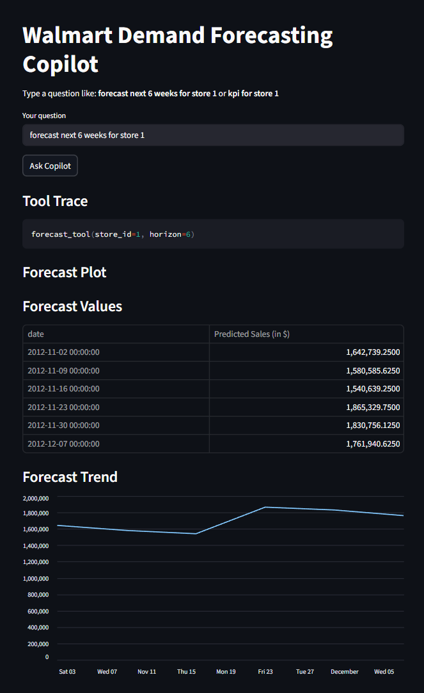
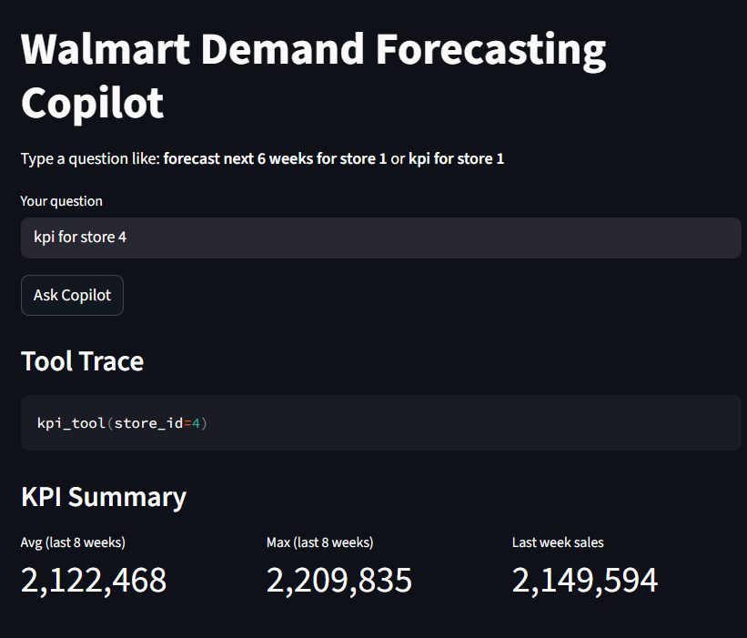
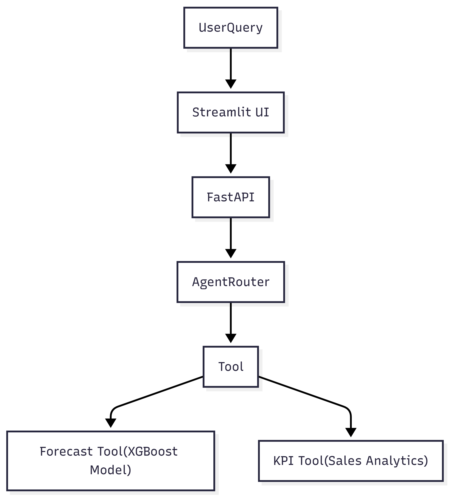

# Walmart Demand Forecasting Copilot

An **AI-powered retail analytics assistant** that forecasts Walmart store sales and answers natural language queries through an agent-based workflow.

The project combines **time-series forecasting, API-based ML serving, and a conversational interface** to help users analyze sales trends and generate predictions.

---

# Demo

### Forecast Example

Query: forecast next 6 weeks for store 1

Response:
- date
- predicted sales

### KPI Example

Query: kpi for store 1

Response:
- Average weekly sales
- Maximum weekly sales
- Last week’s sales

---

# UI Preview

---

# Architecture

---

# Features

## 1. Sales Forecasting

Predict future weekly sales using machine learning.

## 2. KPI Analytics

Compute store performance metrics:
- Average sales
- Maximum weekly sales
- Recent sales trends

## 3. Natural Language Interface

Users interact using simple queries which are routed through an agent layer.

## 4. Interactive Dashboard

The Streamlit interface allows users to:
- Ask questions
- Visualize forecasts
- View KPI metrics
- Explore store sales

---

# Tech Stack 

| Component        | Technology       |
| ---------------- | ---------------- |
| Backend API      | FastAPI          |
| Machine Learning | XGBoost          |
| Data Processing  | Pandas           |
| UI               | Streamlit        |
| Visualization    | Streamlit Charts |
| Language         | Python           |

---

# Dataset

The project uses the Walmart Weekly Sales dataset containing:
- Store ID
- Weekly sales
- Holiday flag
- Temperature
- Fuel price
- CPI
- Unemployment rate

The dataset can be found [here](https://www.kaggle.com/datasets/mikhail1681/walmart-sales)

---

# Model 

The forecasting model uses XGBoost regression with time-series feature engineering.

Features include:
- Lag features (lag_1, lag_2, lag_4)
- Rolling averages
- Week and month indicators
- Economic indicators (CPI, fuel price, unemployment)

---

# Future Improvements
1. Add historical vs predicted sales visualization
2. Add confidence intervals for forecasts
3. Support multi-store forecasting
4. Integrate LLM-based explanations
5. Deploy API to cloud platforms (AWS / GCP)

